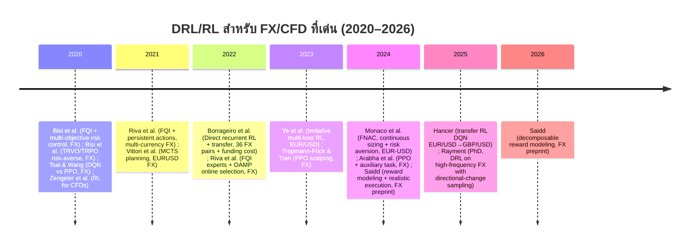
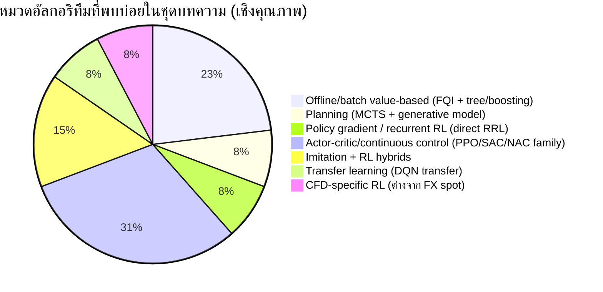

# งานวิจัยเชิงลึก: ตัวแทน Deep Reinforcement Learning สำหรับเทรด Forex/CFD (ช่วงปี 2020–2026)

## บทสรุปผู้บริหาร

รายงานนี้รวบรวมและวิเคราะห์งานวิจัยเชิงวิชาการ (ปี 2020–2026) ที่ใช้ **Deep Reinforcement Learning (DRL)** หรือ RL เชิงลึก/ใกล้เคียงเพื่อ “ตัดสินใจเทรด” ในตลาด **Forex** และ/หรือ **CFD** พร้อมตารางเปรียบเทียบอย่างน้อย 15 เรื่อง ครอบคลุม **อัลกอริทึม**, **การออกแบบ state/action/reward**, **ข้อมูลที่ใช้ (คู่เงิน/ช่วงเวลา/การแบ่งชุด train–test)**, **ตัวชี้วัดและ baseline**, **ความสามารถในการทำซ้ำ (reproducibility)** และ **ข้อจำกัดเชิงวิธีวิทยา** (เช่น transaction cost, funding/rollover, non‑stationarity) citeturn27view0turn29view0turn31view0turn37view2turn7search2

ข้อค้นพบสำคัญจากงานที่เด่นในช่วง 2020–2026:

- กลุ่มงานที่ “เฉพาะทาง FX และมีรายละเอียดสภาพแวดล้อมชัด” มักโน้มไปทาง **offline/batch RL** โดยเฉพาะ **Fitted Q‑Iteration (FQI)** ผสานตัวทำนายแบบ tree ensemble (เช่น Extra‑Trees, XGBoost) และแก้ปัญหาความถี่การตัดสินใจด้วย “**action persistence**” เพื่อเพิ่ม signal‑to‑noise สำหรับข้อมูลรายนาที citeturn27view0turn29view0  
- ประเด็น “ความสมจริงด้านต้นทุน” เป็นจุดแยกคุณภาพงาน: บางงานจำลอง **ค่าธรรมเนียมคงที่** หรือไม่คิด slippage แต่มีงานที่พยายามนับรวม **bid‑ask spread** หรือแม้แต่ **funding/rollover** ผ่าน tomnext/forward points ซึ่งเป็นหัวใจของ FX จริง citeturn31view0turn37view2turn29view0  
- Non‑stationarity (regime shift/drift) ถูกยกระดับจาก “ข้อควรระวัง” ไปสู่สถาปัตยกรรมเชิงระบบ เช่น “**online model selection ของกลุ่มผู้เชี่ยวชาญ (experts)** ที่ฝึกด้วย offline RL” (FQI) แล้วให้ online learning ช่วยถ่วงน้ำหนักรายวัน citeturn29view0  
- งานแนว **continuous action** (เช่นให้เลือก “ขนาด position”) เริ่มเด่นขึ้น โดยให้เหตุผลว่าช่วยโมเดล **ค่าธรรมเนียมขึ้นกับขนาดคำสั่ง** และรองรับการใส่ **risk aversion** ได้เป็นธรรมชาติกว่า action แบบ discrete {‑1,0,1} citeturn21academia31  
- ฝั่ง **CFD** ในวรรณกรรมวิชาการ (2020–2026) พบ “น้อยกว่า FX spot” อย่างมีนัย โดยส่วนหนึ่งเป็นเพราะ CFD มีความผูกกับโครงสร้างโบรกเกอร์/สัญญา และข้อมูล/กฎการคิดต้นทุนไม่เป็นมาตรฐานสาธารณะเท่า FX spot หรือ futures citeturn7search2turn31view0turn37view2  

## ขอบเขตและวิธีการสืบค้น

เกณฑ์คัดเลือก:
- ปีตีพิมพ์/เผยแพร่: **2020–2026 (รวมปลายทาง)**  
- หัวข้อ: **DRL/RL เชิงลึก (หรือ RL ที่ใช้ neural function approximation / deep policy / deep value / หรือถูกใช้งานร่วมกับสถาปัตยกรรมเชิงลึก)** สำหรับ **การตัดสินใจเทรด FX หรือ CFD** (รวมถึงงานที่เน้น hedging/positioning ใน FX หากกลไกเป็น “agent ตัดสินใจต่อเนื่อง”) citeturn27view0turn31view0turn37view2turn21search24  
- แหล่งอ้างอิง: ให้ความสำคัญกับ **publisher page / arXiv / IEEE / Springer / ACM / MDPI** และ PDF ทางการหรือ preprint ที่เข้าถึงได้ citeturn35view0turn7search2turn9search13turn21search24  

ข้อจำกัดที่ต้องแจ้ง:
- บางบทความ/หน้า publisher ให้ข้อมูลเชิงทดลองไม่ครบ (เช่นชุดข้อมูล/การแบ่ง train‑test) ในส่วน summary/abstract และไม่สามารถดึงรายละเอียดทั้งหมดได้จากแหล่งที่เข้าถึงได้ในครั้งนี้ จึงระบุเป็น “ไม่พบ/ไม่ระบุ” ในช่องที่เกี่ยวข้อง โดยยังให้ DOI/ลิงก์ต้นทางตามที่ร้องขอ citeturn21search2turn8search19turn7search2turn9search3  

## ภาพรวมเชิงปริมาณของงานที่คัดเลือก

> หมายเหตุ: การนับเป็น “เชิงหมวด” เพื่อสะท้อนแนวทางหลักของแต่ละงาน มากกว่าการนับอัลกอริทึมย่อยทั้งหมด

## ตารางเปรียบเทียบงานวิจัยสำคัญอย่างน้อย 15 เรื่อง

ตารางนี้พยายามบีบอัด attribute หลัก: อัลกอริทึม, state/action/reward, ข้อมูล, metrics/baselines, การทำซ้ำ

| Paper | ปี / เวที | อัลกอริทึม DRL/RL | State (สรุป) | Action | Reward/Objective | ข้อมูล (คู่เงิน/สินทรัพย์) + split | Metrics + Baselines | โค้ด/ข้อมูล |
|---|---|---|---|---|---|---|---|---|
| Foreign Exchange Trading: A Risk-Averse Batch Reinforcement Learning Approach | 2020, ICAIF (proceedings) citeturn21search2 | FQI (batch RL) + multi-objective risk control citeturn21search2 | ไม่ระบุละเอียดในหน้า repository (ระบุเพียง “intraday FX + temporal patterns”) citeturn21search2 | ไม่ระบุ citeturn21search2 | multi-objective เพื่อคุม “noisy profits”; risk↑ → policy “smooth” ถือ position นานขึ้น citeturn21search2 | intraday FX (ไม่ระบุคู่เงิน/ช่วงปีในหน้า repository) citeturn21search2 | ไม่ระบุ citeturn21search2 | PDF ทางการมี แต่เข้าถึงเชิงรายละเอียดได้จำกัด; DOI: 10.1145/3383455.3422571 citeturn21search2turn12search2 |
| Risk-averse Trust Region Optimization for Reward-Volatility Reduction (มีทดลอง FX) | 2020, IJCAI‑20 (FinTech track) citeturn23view2 | TRVO (risk‑averse TRPO-style; mean‑volatility) citeturn23view2 | FX รายนาที; episode = 1 trading day; 1170 steps/day citeturn23view2 | position ต่อสินทรัพย์ (USD/EUR, USD/JPY) citeturn23view2 | ใช้ reward + risk term (reward volatility) และเทียบ TRPO-exp ฯลฯ citeturn23view2 | คู่เงิน: USD/EUR, USD/JPY; train 2017; test 2018; fee f=1e‑6 citeturn23view2 | เปรียบเทียบ MV‑PG, DRL, TRPO‑exp citeturn23view2 | ข้อมูลไม่ระบุแหล่งดาวน์โหลด; โค้ดไม่ระบุ |
| Deep Reinforcement Learning for Foreign Exchange Trading (arXiv:1908.08036, revised 2020) | 2020, arXiv preprint (revised Jun 2020) citeturn9search22turn8search0 | DQN vs PPO; ใช้ภาพ GAF (Gramian Angular Field) citeturn8search0 | GAF heat‑map จาก price time series citeturn8search0 | 3 actions citeturn8search0 | ปรับ policy statistical arbitrage (Sure‑Fire) citeturn8search0 | EUR/USD, GBP/USD, AUD/USD; 4H data; train 2018‑08‑01→2018‑11‑30; test 2018‑12‑01→2018‑12‑31 citeturn8search0 | เปรียบเทียบ DQN vs PPO citeturn8search0 | DOI(arXiv): 10.48550/arXiv.1908.08036 citeturn9search22 |
| Contracts for Difference: A Reinforcement Learning Approach | 2020, Journal of Risk and Financial Management (JRFM) citeturn7search2 | RL สำหรับ CFD (รายละเอียดอัลกอริทึมย่อยไม่ปรากฏใน snippet) citeturn7search2 | ไม่ระบุใน snippet citeturn7search2 | ไม่ระบุ citeturn7search2 | “Reinforcement learning approach” สำหรับ CFD citeturn7search2 | CFD (ไม่ระบุสินทรัพย์/ช่วงเวลาใน snippet) citeturn7search2 | ไม่ระบุ citeturn7search2 | Publisher page (MDPI/JRFM) มี; โค้ดไม่ระบุ citeturn7search2 |
| Learning FX Trading Strategies with FQI and Persistent Actions | 2021, ICAIF ’21 citeturn27view0 | FQI + Extra‑Trees; ทดลอง persistence {1,5,10} citeturn27view0 | last 60 normalized rate diffs; time‑of‑day; portfolio position citeturn27view0 | 2‑currency: {‑1,0,1}; 3‑currency: 5 positions (long/short ต่อ 1 คู่ หรือ flat) citeturn27view0 | reward แปลงให้ผลตอบแทนอยู่หน่วยเดียว (แปลงรายวันโดยใช้อัตรา ณ ขณะนั้นเป็น approx) citeturn27view0 | HistData 2017–2020; โฟกัส 8:00–18:00 CET; train 2017–2018; val 2019; test 2020; allocation 100k$, fee=1$ citeturn27view0 | P&L%, Sharpe, Max Drawdown; baselines Buy&Hold/Sell&Hold citeturn27view0 | ข้อมูลเปิด: `https://www.histdata.com/download-free-forex-data/` citeturn27view0; โค้ดไม่ระบุ |
| Monte Carlo Tree Search for Trading and Hedging | 2021, ICAIF ’21 citeturn31view0 | MCTS (Open‑Loop UCT + progressive widening) + Q‑learning backup; ใช้ generative model แบบ nearest neighbors citeturn31view0 | state = window 60 prices + timestep t + prev position x_{t-1} citeturn31view0 | {‑1,0,1} (short/flat/long) ขนาดหน่วย citeturn31view0 | r_t = a_t·(p_t−p_{t−1}) − (bid−ask)/2·|a_t−x_t| citeturn31view0 | EURUSD; 1‑min prices 2017–2019; episode สุ่มวันใน 2019; horizon=200 นาที; ทำซ้ำ 50 episodes citeturn31view0 | รายงาน average return + 95% CI; สรุปว่ากำไรได้เมื่อไม่คิด cost แต่เมื่อเพิ่ม cost แล้ว model มัก “ไม่เทรด” citeturn30view0turn31view0 | แหล่งข้อมูลดิบไม่ระบุ; โค้ดไม่ระบุ |
| Reinforcement Learning for Systematic FX Trading | 2022, IEEE Access citeturn35view0turn37view2 | Direct recurrent RL (policy gradient) + transfer (GMM→RBF features); online learning ด้วย extended Kalman filter citeturn36view0turn37view2 | features = daily returns (36 pairs) citeturn37view1 | “risk position” ต่อคู่เงิน (เรียนรู้เป้าหมาย position โดยตรง) citeturn36view0turn37view1 | maximize quadratic economic utility; reward/returns net of transaction + funding (tomnext) citeturn36view0turn37view1turn37view2 | Refinitiv daily data 36 FX pairs + tomnext; 2010‑12‑07→2021‑10‑21 (2,840 obs/pair); train 1/3 แรก, test 2/3 หลัง; เรียนออนไลน์ต่อใน test citeturn37view2turn37view1 | annualised information ratio; รายงานตัวอย่าง IR=0.52 และ compound return 9.3% net costs; มี baseline carry/momentum ฯลฯ citeturn35view0turn36view0turn37view1turn37view2 | ข้อมูล proprietary (Refinitiv); DOI: 10.1109/ACCESS.2021.3139510 citeturn35view0 |
| Addressing Non-Stationarity in FX Trading with Online Model Selection of Offline RL Experts | 2022, ICAIF ’22 citeturn29view0 | 2‑layer: FQI experts (offline) + OAMP (online expert learning) citeturn28view0turn29view0 | FX minute features: ex‑rate variations + time‑of‑day + day‑of‑week citeturn29view0 | expert action ∈ {‑1,0,1}; executed action = weighted sum → continuous in [‑1,1] citeturn29view0 | daily losses = −mean cumulative return; อัปเดต weight รายวัน citeturn29view0 | HistData 2017–2021; train experts 2 ปีแรก; val ปีที่ 3; test 2021; pairs: GBP/USD, AUD/USD citeturn29view0turn28view2 | เทียบ Buy&Hold/Sell&Hold และ baseline “best single expert” citeturn29view0 | ข้อมูลเปิด: `https://www.histdata.com/download-free-forex-data/` citeturn29view0; โค้ดไม่ระบุ |
| Optimised Forex Trading using Ensemble of Deep Q‑Learning Agents | 2022, ACM proceedings (ตามหน้า DL) citeturn8search19 | Ensemble of deep Q‑learning agents (ตามชื่อบทความ) citeturn8search19 | ไม่ระบุใน snippet citeturn8search19 | ไม่ระบุ citeturn8search19 | ไม่ระบุ citeturn8search19 | Forex (ไม่ระบุคู่เงิน/ช่วงเวลาใน snippet) citeturn8search19 | ไม่ระบุ citeturn8search19 | DOI: 10.1145/3549206.3549280 citeturn8search19 |
| Human‑aligned trading by imitative multi‑loss reinforcement learning | 2023, Expert Systems with Applications citeturn9search13turn8search33 | ผสาน imitation learning + (single‑step & multi‑step) Q‑learning; ระบุ SAC/PG เป็นส่วนหนึ่งของกรอบ citeturn8search33turn9search13 | ไม่ระบุใน snippet (แต่กล่าวถึง EUR/USD โดยตรง) citeturn9search13 | ไม่ระบุใน snippet citeturn9search13 | multi‑loss เพื่อ “align” กับพฤติกรรมมนุษย์ + RL losses citeturn8search33turn9search13 | EUR/USD (ระบุในหน้า publisher snippet) citeturn9search13 | ไม่ระบุใน snippet citeturn9search13 | Publisher page (Elsevier) มี; โค้ดไม่ระบุ citeturn9search13 |
| Scalp the Foreign Exchange Market with Deep Reinforcement Learning | 2023, (conference paper; PDF เผยแพร่แบบ CC) citeturn8search2turn9search1 | PPO; CNN บน GAF; มี regression head เพื่อคุมขนาด market order citeturn8search2turn9search1 | technical indicators→GAF (ภาพ) citeturn9search1 | policy action + order sizing head citeturn8search2turn9search1 | ไม่ระบุใน snippet citeturn8search2 | FX (scalping) citeturn8search2 | ไม่ระบุใน snippet citeturn8search2 | PDF ได้จากแหล่งเผยแพร่; โค้ดไม่ระบุ citeturn8search2 |
| Exploiting Risk‑Aversion and Size‑dependent fees in FX Trading with Fitted Natural Actor‑Critic | 2024, arXiv preprint citeturn21academia31turn17search2 | FNAC (Fitted Natural Actor‑Critic); continuous sizing; ใส่ cost แบบขึ้นกับขนาด + risk aversion citeturn21academia31turn17search2 | intraday FX features (รายละเอียดเชิงลึกไม่อยู่ใน abstract snippet) citeturn21academia31 | continuous action (ขนาดคำสั่ง/position) citeturn21academia31 | ออกแบบเพื่อให้ modeling cost & risk aversion สมจริงขึ้น citeturn21academia31 | EUR‑USD historical data citeturn21academia31 | กล่าวถึงเทียบกับ PPO/FQI ในแหล่งสรุป citeturn17search2 | DOI(arXiv): 10.48550/arXiv.2410.23294 citeturn21academia31 |
| Improving DRL Agent Trading Performance in Forex using Auxiliary Task | 2024, arXiv preprint citeturn9search3 | PPO + auxiliary task (เพิ่มสัญญาณการเรียนรู้) citeturn9search3 | ไม่ระบุใน snippet citeturn9search3 | ไม่ระบุใน snippet citeturn9search3 | ไม่ระบุใน snippet citeturn9search3 | Forex (ไม่ระบุคู่เงิน/ช่วงเวลาใน snippet) citeturn9search3 | ไม่ระบุใน snippet citeturn9search3 | DOI(arXiv): 10.48550/arXiv.2411.01456 citeturn9search3 |
| Transferable Reinforcement Learning in Forex Trading | 2025, TU Delft thesis/tech report citeturn9search11turn8search22 | DQN transfer: EUR/USD → GBP/USD; เปรียบเทียบเทคนิค transfer หลายแบบ citeturn9search11 | long/short/hold แบบ discrete (ตามสรุปใน thesis snippet) citeturn8search22turn9search11 | discrete {long, short, hold} citeturn8search22 | reward สำหรับเทรด (รายละเอียดขึ้นกับ thesis) citeturn9search11 | EUR/USD (source) และ GBP/USD (target) citeturn9search11 | เปรียบเทียบ zero‑shot, fine‑tuning ฯลฯ citeturn9search11 | PDF เปิด; ผู้เขียนระบุ setup เพื่อ replication citeturn9search11 |
| Deep Reinforcement Learning for Trading Strategy Development on High‑Frequency Currency Data Using Directional Changes Sampling | 2025, PhD thesis (University of Essex) citeturn21search24turn9search20 | DRL บน high‑frequency FX; ใช้ directional changes sampling; ทดสอบหลายอัลกอริทึม (เช่น PPO/DQN/A2C/TRPO ในงานต่อยอดของผู้เขียน) citeturn9search20turn21search24 | high‑frequency currency data + DC features citeturn21search24 | trading policy (รายละเอียดขึ้นกับบท) citeturn21search24 | เน้นผลตอบแทน/ความเสี่ยง (Total Return, MDD, Calmar) citeturn21search24 | หลายคู่เงิน (ระบุ 14 pairs ใน thesis) citeturn9search20turn21search24 | Total Return, Max Drawdown, Calmar Ratio ฯลฯ citeturn21search24 | PDF เปิด (reproducibility สูงระดับ thesis) citeturn21search24 |

## รายการบทความแบบมีคำอธิบาย (Annotated list)

ด้านล่างเป็นรายการที่สอดคล้องกับ Forex/CFD และอยู่ในช่วง 2020–2026 โดยพยายามให้ข้อมูลครบตามหัวข้อที่ร้องขอ (หากไม่ปรากฏในแหล่งต้นทางที่เข้าถึงได้ จะระบุว่า “ไม่พบ/ไม่ระบุ”)

**Foreign Exchange Trading: A Risk-Averse Batch Reinforcement Learning Approach** — ผู้เขียน: Lorenzo Bisi, Pierre Liotet, Luca Sabbioni, Gianmarco Reho, Nico Montali, Marcello Restelli, Cristiana Corno; ปี 2020; เวที: ICAIF ’20; DOI: 10.1145/3383455.3422571. citeturn21search2turn12search2  
สรุป: เสนอการหา strategy เทรด FX intraday ด้วย **Fitted Q‑Iteration (FQI)** แบบ batch และเพิ่ม **multi‑objective formulation** เพื่อคุมความเสี่ยงจาก “กำไรที่ noisy” โดยรายงานว่าเมื่อเพิ่ม risk‑aversion policy จะ “smooth” ขึ้นและถือ position นานขึ้น. citeturn21search2  
State/Action/Reward: หน้า repository ระบุระดับแนวคิด (temporal patterns, risk control) แต่ไม่ลงรายละเอียดโครงสร้าง state/action/reward ใน snippet ที่เข้าถึงได้. citeturn21search2  
ข้อมูล: ระบุว่าเป็น intraday FX แต่ไม่เห็นคู่เงิน/ช่วงเวลา/การแบ่ง train‑test ใน snippet. citeturn21search2  
Metrics/Baselines: ไม่ระบุใน snippet. citeturn21search2  
โค้ด: ไม่พบลิงก์ GitHub ใน snippet; ข้อมูลการทำซ้ำจึงพึ่ง PDF เต็ม/ภาคผนวก. citeturn21search2  
จุดเด่น/ข้อจำกัด: เด่นที่นำ offline/batch RL มาผูกกับ risk‑aversion; จำกัดที่รายละเอียด experimental protocol ไม่ปรากฏในหน้า metadata ที่เข้าถึงได้.

**Risk-averse Trust Region Optimization for Reward-Volatility Reduction** (มีผลทดลอง FX) — ผู้เขียน: Lorenzo Bisi และคณะ; ปี 2020; เวที: IJCAI‑20 (AI in FinTech track); DOI ของงานตีพิมพ์มีระบุในรายการอ้างอิง; แหล่งอธิบายการทดลอง FX ที่ใช้อ้างในรายงานนี้มาจากวิทยานิพนธ์ของผู้เขียน. citeturn22view0turn23view2  
สรุป: เสนอแนว **risk‑averse policy optimization** แบบ trust‑region โดยเพิ่มเป้าหมายลด “reward volatility” และทดสอบกับงานเทรดจริง รวมถึง FX. citeturn23view2  
State/Action/Reward: ในการทดลอง FX ใช้ข้อมูลรายนาที, agent ตัดสินใจได้ทุกนาที (1170 steps/วัน); มองเป็นการคุม position ต่อคู่เงิน. citeturn23view2  
ข้อมูล: spot FX **USD/EUR และ USD/JPY**; train ปี 2017, test ปี 2018; ค่าธรรมเนียมต่อธุรกรรม f=10^-6; training 5×10^7 steps. citeturn23view2  
Metrics/Baselines: เทียบกับ MV‑PG, DRL (Direct Reinforcement Learning), และ TRPO‑exp. citeturn23view2  
จุดเด่น/ข้อจำกัด: จุดเด่นคือ “คุมความผันผวนของ reward” อย่างเป็นระบบ; ข้อจำกัดคือความสามารถทำซ้ำอาจขึ้นกับการเข้าถึงข้อมูลรายนาทีและรายละเอียดที่อยู่ใน paper/appendix.

**Deep Reinforcement Learning for Foreign Exchange Trading** (arXiv:1908.08036) — ผู้เขียน: Yun‑Cheng Tsai, Chun‑Chieh Wang; ปี 2020 (ปรับปรุงเวอร์ชัน Jun 2020); เวที: arXiv; DOI(arXiv): 10.48550/arXiv.1908.08036. citeturn9search22turn8search0  
สรุป: แปลงอนุกรมราคาเป็นภาพ **Gramian Angular Field (GAF)** แล้วเทียบ **DQN** กับ **PPO** ในโจทย์ FX. citeturn8search0  
State/Action/Reward: state เป็น GAF heat‑map; action มี 3 แบบ; reward/กลยุทธ์กล่าวถึง Sure‑Fire statistical arbitrage. citeturn8search0  
ข้อมูล: EUR/USD, GBP/USD, AUD/USD; ข้อมูล 4 ชั่วโมง; train 2018‑08‑01 ถึง 2018‑11‑30; test 2018‑12‑01 ถึง 2018‑12‑31. citeturn8search0  
Metrics/Baselines: เทียบ DQN vs PPO (รายละเอียด metric ไม่อยู่ใน snippet ที่มี). citeturn8search0  
โค้ด: ไม่ระบุใน snippet.  
จุดเด่น/ข้อจำกัด: เด่นที่ state representation แบบภาพช่วยดึง pattern; จำกัดที่การทดลองสั้นมาก (train ~4 เดือน, test 1 เดือน) จึงเสี่ยงต่อการสรุปทั่วไป/overfitting และความเสถียรเชิงสถิติ.

**Contracts for Difference: A Reinforcement Learning Approach** — ผู้เขียน: Nico Zengeler และคณะ; ปี 2020; วารสาร: JRFM; ลิงก์จาก publisher page. citeturn7search2  
สรุป: เสนอการใช้ RL กับผลิตภัณฑ์ **CFD** ซึ่งเป็นอนุพันธ์ที่ให้ผู้ลงทุนเก็งกำไรจากการเปลี่ยนแปลงราคาโดยไม่ถือสินทรัพย์อ้างอิง (รายละเอียดกลไก/อัลกอริทึมเชิงลึกไม่ปรากฏใน snippet). citeturn7search2  
State/Action/Reward/Data/Metrics: ไม่พบรายละเอียดใน snippet ที่เข้าถึงได้. citeturn7search2  
จุดเด่น/ข้อจำกัด: จุดเด่นคือเป็นงานที่ “เฉพาะ CFD” (ซึ่งพบค่อนข้างน้อยในวรรณกรรมช่วง 2020–2026); ข้อจำกัดคือจำเป็นต้องอ่าน PDF เต็มเพื่อดึงรายละเอียด state/action/reward และการประเมิน.

**Learning FX Trading Strategies with FQI and Persistent Actions** — ผู้เขียน: Antonio Riva, Lorenzo Bisi, Pierre Liotet, Luca Sabbioni, Edoardo Vittori, Marco Pinciroli, Michele Trapletti, Marcello Restelli; ปี 2021; เวที: ICAIF ’21; DOI อยู่ในส่วนหัวของเอกสาร. citeturn26view3turn27view0  
สรุป: ออกแบบระบบเทรด FX แบบรายนาทีด้วย **FQI + Extra‑Trees** และศึกษาผลของความถี่การตัดสินใจผ่าน **action persistence** โดยชี้ว่าค่า persistence สูงขึ้นช่วยให้จับ **temporal patterns** และลดผลเสียของ noise ได้. citeturn27view0  
State: ใช้ last 60 exchange‑rate variations (รายนาที, normalized), เวลาในวัน (minutes), และ portfolio position ปัจจุบัน. citeturn27view0  
Action: 2‑currency ใช้ {‑1,0,1} (short/flat/long); 3‑currency จำกัดให้ถือได้ทีละคู่ (5 positions) และสลับคู่เงินด้วยต้นทุนที่ “นับสองครั้ง” ผ่านเส้นทางผ่าน flat. citeturn27view0  
Reward: นิยาม reward ให้ผลตอบแทนอยู่หน่วยเดียว โดยใช้ exchange rate ณ ขณะนั้นแทนอัตราปลายวันเป็น approximation และใช้ γ=1 (undiscounted). citeturn27view0  
ข้อมูล: ดาวน์โหลดจาก HistData; 2017–2020; จำกัดช่วงเวลายุโรป 8:00–18:00 CET; train 2017–2018, validate 2019, test 2020; allocation 100k$; fee = 1$/trade. citeturn27view0  
Metrics & baselines: P&L (% ของทุน), Sharpe ratio, Max Drawdown; เทียบ Buy&Hold และ Sell&Hold. citeturn27view0  
โค้ด/ทำซ้ำ: ชุดข้อมูลเปิดผ่าน HistData และขั้นตอน dataset generation ระบุชัด ทำให้ “ทำซ้ำได้” ในระดับมาก แม้ไม่ให้ GitHub. citeturn27view0  
ข้อจำกัด: ผู้เขียนยอมรับว่า cost model ยังเรียบ (ควรใช้ bid‑ask spread แบบทันที) และยังไม่จัดการ non‑stationarity แบบ explicit. citeturn26view3turn27view0  

**Monte Carlo Tree Search for Trading and Hedging** — ผู้เขียน: Edoardo Vittori, Amarildo Likmeta, Marcello Restelli; ปี 2021; ICAIF ’21; DOI: 10.1145/3490354.3494402. citeturn30view1turn31view0  
สรุป: นำ **MCTS** มาใช้วางแผนเทรด (และ hedging) โดยใช้ **generative model แบบ nearest neighbors** จากประวัติราคา และปรับ back‑up ใน tree ด้วย **Q‑learning temporal‑difference update** เพื่อลด variance ของค่าประมาณ. citeturn30view1turn31view0  
State: window ราคา 60 นาที + timestep + position ก่อนหน้า. citeturn31view0  
Action: {‑1,0,1}. citeturn31view0  
Reward: P&L จาก price change ลบต้นทุนแปรผันตาม bid‑ask spread และการเปลี่ยน position. citeturn31view0  
ข้อมูล: EURUSD; 1‑minute prices 2017–2019; เลือกวันจาก 2019; horizon=200 นาที; 50 episodes; รายงานผลแบบ average + 95% CI. citeturn31view0  
ผลและ baselines: ข้อค้นพบเชิงปฏิบัติสำคัญคือ “ถ้าคิด cost แบบ spread” agent อาจเลือกที่จะไม่เทรด (สะท้อนว่าเมื่อ cost realistic ขึ้น alpha ต้องมากพอ). citeturn30view0turn31view0  
ข้อจำกัด: พึ่งพา generative model จากอดีต (NN windows) ซึ่งอาจไม่ครอบคลุม regime ใหม่ และความซับซ้อนในการปรับให้รับ slippage/fees จริง.

**Reinforcement Learning for Systematic FX Trading** — ผู้เขียน: Gabriel Borrageiro, Nick Firoozye, Paolo Barucca; ปี 2022 (IEEE Access; arXiv ตั้งแต่ 2021); DOI: 10.1109/ACCESS.2021.3139510; DOI(arXiv): 10.48550/arXiv.2110.04745. citeturn35view0turn37view2  
สรุป: เสนอ **direct recurrent reinforcement learning (policy gradient)** ที่ “target position โดยตรง” และใช้ **online inductive transfer learning** โดยถ่ายโอน feature representation จาก **Gaussian mixture model → radial basis function network** เพื่อให้ feature มีพลังขึ้นใน FX. citeturn36view0turn37view1turn37view2  
State: daily returns ของ 36 คู่เงินหลัก (เป็น feature space) citeturn37view1turn37view2  
Action: risk position ต่อคู่เงิน (continuous notion ของ position sizing/targeting) citeturn37view1turn36view0  
Reward/Objective: optimize **quadratic utility** และประเมินผลด้วย P&L ที่ **หัก transaction cost และ funding/rollover (tomnext)** ซึ่งเป็นจุดแข็งด้านความสมจริงเทียบงาน FX จำนวนมาก. citeturn36view0turn37view1turn37view2  
ข้อมูล: จาก Refinitiv; daily sampled FX + tomnext; ช่วง 2010‑12‑07 → 2021‑10‑21 (2,840 จุดต่อคู่); แบ่ง train 1/3 แรก vs test 2/3 หลัง และยังเรียนรู้ออนไลน์ใน test. citeturn37view2turn37view1  
Metrics/Baselines: ใช้ annualised information ratio; รายงานตัวอย่าง IR=0.52 และผลตอบแทนทบต้น 9.3% net costs; มี baseline carry (ไม่ต้อง fit), momentum trader ฯลฯ. citeturn35view0turn36view0turn37view1turn37view2  
ข้อจำกัด: ข้อมูล Refinitiv ทำซ้ำยากเพราะเป็น proprietary; แม้ methodology ชัด แต่การทำซ้ำเชิงตัวเลขต้องเข้าถึงข้อมูลเดียวกัน.

**Addressing Non-Stationarity in FX Trading with Online Model Selection of Offline RL Experts** — ผู้เขียน: Antonio Riva และคณะ; ปี 2022; ICAIF ’22; (DOI อยู่ในหัวกระดาษของงาน); citeturn28view0turn29view0  
สรุป: สร้าง pipeline 2 ชั้น: ฝึก **FQI experts** หลายแบบ (ต่าง hyperparameters/persistence) แล้วใช้ **OAMP (Optimistic Adapt ML‑Prod)** เป็น online learner เพื่อถ่วงน้ำหนัก expert ตามผล P&L รายวัน (ตอบโจทย์ non‑stationarity). citeturn28view0turn29view0  
State: exchange‑rate variations ราย นาที + time‑of‑day + day‑of‑week. citeturn29view0  
Action: expert ให้ {‑1,0,1} แต่ action ที่ execute คือ weighted sum ∈ [‑1,1]. citeturn29view0  
Reward/Objective: ใช้ cumulative return ต่อวันเพื่ออัปเดต weights (กำหนด daily losses เป็นลบของผลตอบแทนเฉลี่ยสะสม) citeturn29view0  
ข้อมูล: HistData; GBP/USD และ AUD/USD; 2017–2021; train 2 ปีแรก, validate ปีที่ 3, test ปี 2021. citeturn29view0turn28view2  
Baselines: Buy&Hold/Sell&Hold + best single expert. citeturn29view0  
จุดเด่น/ข้อจำกัด: เด่นที่แยก “การสร้าง policy” กับ “การเลือก policy” เพื่อรับ drift; ข้อจำกัดคือยังพึ่ง offline experts ที่อาจล้าสมัยเมื่อ regime เปลี่ยนแรง และต้นทุน/สภาพคล่องอาจยัง simplified.

**Optimised Forex Trading using Ensemble of Deep Q‑Learning Agents** — ปี 2022; แหล่ง: ACM DL; DOI: 10.1145/3549206.3549280. citeturn8search19  
สรุป: เสนอการทำ **ensemble** ของ deep Q‑learning agents เพื่อเพิ่ม robustness ใน Forex (รายละเอียดเชิงลึกของ state/action/reward/data ไม่ปรากฏใน snippet ที่เข้าถึงได้). citeturn8search19  
จุดเด่น: แนวคิด ensemble มักช่วยลด variance/ลด sensitivity ต่อ seed; ข้อจำกัด: ต้องอ่านตัวเต็มเพื่อทราบความสมจริงด้านต้นทุนและการแบ่งชุดข้อมูล.

**Human‑aligned Trading by Imitative Multi‑loss Reinforcement Learning** — ปี 2023; วารสาร: Expert Systems with Applications (Elsevier). citeturn9search13turn8search33  
สรุป: เสนอกรอบ “ทำให้ agent สอดคล้องกับพฤติกรรมมนุษย์ (human alignment)” โดยผสาน supervised + single‑step/multi‑step Q‑learning และ imitation learning เป็น multi‑loss; ระบุการประยุกต์ใน EUR/USD. citeturn8search33turn9search13  
State/Action/Reward/Data/Metrics: รายละเอียดเชิงลึกไม่ปรากฏใน snippet; อย่างไรก็ดีตัวงานชี้ว่าการ align ควรเป็นฐานก่อนปล่อยให้ agent “สร้างนวัตกรรม” เองในงานเทรดจริง. citeturn9search13  

**Scalp the Foreign Exchange Market with Deep Reinforcement Learning** — ผู้เขียน: Marina Tropmann‑Frick, Phuc Tran; ปี 2023; (เผยแพร่ PDF แบบ CC BY‑NC 4.0); citeturn8search2turn9search1  
สรุป: แนว scalping FX ด้วย **PPO**; ใช้ technical indicators ถูกเข้ารหัสเป็น **GAF** และใช้ CNN หา pattern; เพิ่ม regression head เพื่อกำหนดขนาดคำสั่ง market order. citeturn8search2turn9search1  
ข้อมูล/metrics: ไม่ปรากฏใน snippet ที่เข้าถึงได้. citeturn8search2  
ข้อเด่น/ข้อจำกัด: เด่นที่ขยับจาก “directional” ไปสู่ “order sizing”; จำกัดที่ต้องตรวจความสมจริงของ cost/slippage โดยเฉพาะสำหรับ scalping.

**Exploiting Risk‑Aversion and Size‑dependent fees in FX Trading with Fitted Natural Actor‑Critic** — ผู้เขียน: Vito Alessandro Monaco และคณะ; ปี 2024; arXiv; DOI(arXiv): 10.48550/arXiv.2410.23294. citeturn21academia31turn17search2  
สรุป: ใช้ **Fitted Natural Actor‑Critic (FNAC)** เพื่อให้ action เป็น continuous และกำหนด **ขนาดการเทรดได้** ทำให้จำลอง **transaction costs ที่ขึ้นกับขนาดคำสั่ง** ได้ และเอื้อต่อการฝัง **risk‑averse behavior**; ทดลองบน EUR‑USD historical data. citeturn21academia31turn17search2  
State/Reward/Metrics: รายละเอียดเชิงลึกของ feature set และ protocol ไม่ปรากฏใน abstract snippet ที่ใช้ได้. citeturn21academia31  
จุดเด่น: จับ pain point ใหญ่ของ FX/CFD คือ fee model + sizing; จุดจำกัด: ทำซ้ำต้องพึ่งรายละเอียดในตัว paper เต็มและข้อมูลราคา/สเปรด/ค่าธรรมเนียม.

**Improving Deep Reinforcement Learning Agent Trading Performance in Forex using Auxiliary Task** — ผู้เขียน: Sahar Arabha, Davoud Sarani, Parviz Rashidi‑Khazaee; ปี 2024; arXiv; DOI(arXiv): 10.48550/arXiv.2411.01456. citeturn9search3  
สรุป: ใช้ **PPO** และเพิ่ม **auxiliary task** เพื่อช่วยสัญญาณการเรียนรู้ให้ agent เทรด FX ดีขึ้น (รายละเอียด state/action/data ไม่ปรากฏใน snippet). citeturn9search3  
จุดเด่น: auxiliary tasks เป็นเทคนิคที่มักช่วยลด sample complexity/เพิ่ม representation; ข้อจำกัด: ต้องอ่านตัวเต็มเพื่อประเมินความสมจริงของต้นทุนและการทดสอบ out‑of‑sample.

**Transferable Reinforcement Learning in Forex Trading** — ผู้เขียน: (Y.) Hancer; ปี 2025; รายงาน/วิทยานิพนธ์ TU Delft; PDF เปิด. citeturn9search11turn8search22  
สรุป: ศึกษา transfer learning ในบริบท FX โดยย้าย agent **DQN** ที่ฝึกบน EUR/USD ไปยัง GBP/USD และเทียบเทคนิค transfer 4 แบบ (zero‑shot, full fine‑tuning, partial fine‑tuning, reward‑function transfer) เทียบกับ non‑transfer baseline. citeturn9search11  
จุดเด่น: โฟกัส “ทำซ้ำ/ขยายผล” และชี้แนวทางต่อยอดไปคู่เงินอื่น; ข้อจำกัด: งานระดับ thesis ต้องตรวจสอบการจัดการต้นทุน/สเปรดจริงตามที่นิยามในเอกสาร.

**Deep Reinforcement Learning for Trading Strategy Development on High‑Frequency Currency Data Using Directional Changes Sampling** — ผู้เขียน: George Rayment; ปี 2025; PhD thesis; PDF เปิด. citeturn21search24turn9search20  
สรุป: เสนอกรอบเทรด FX ความถี่สูงที่ใช้ **Directional Changes (DC) sampling** แทน fixed‑interval sampling และใช้ DRL เพื่อเรียนรู้กลยุทธ์; รายงานความสามารถในการเทรด profitable ในหลายคู่เงิน และประเมินด้วยตัวชี้วัดด้านผลตอบแทน/ความเสี่ยง. citeturn21search24turn9search20  
ข้อมูล: ระบุว่ามีการเทรดครอบคลุม **14 currency pairs** และหลาย DC thresholds (8 ค่า) ใน thesis. citeturn21search24turn9search20  
Metrics: Total Return, Maximum Drawdown, Calmar Ratio (ระบุใน thesis snippet). citeturn21search24  

**Decomposable Reward Modeling and Realistic Execution for Forex RL** (preprint) — ผู้เขียน: N.A. Saidd; ปี 2026; Preprints.org; PDF เปิด. citeturn9search18turn9search5  
สรุป: เน้น “reward modeling และ execution ที่สมจริง” ใน FX RL โดยอภิปรายการออกแบบ action space ทั้งแบบ discrete interface และ continuous actor‑critic (ยกตัวอย่าง PPO/SAC) และชี้ว่าการทำข้อจำกัดด้าน feasibility ต้องชัดเจนเมื่อใช้ action ต่อเนื่อง. citeturn9search18  
หมายเหตุ: ในฐานะ preprint ควรตรวจการ peer review และผลทดลองตัวเลขก่อนใช้เป็นฐานอ้างอิงเชิงปฏิบัติ.

## สังเคราะห์แนวทางร่วม จุดท้าทาย และช่องว่างเฉพาะ Forex/CFD

แนวทางร่วมที่เห็นชัดในงาน 2020–2026:

แนวทาง “Offline/batch RL สำหรับ FX รายละเอียดสูง” มักกำหนด FX เป็น MDP รายวัน/รายนาที และให้ agent เลือก **position** (long/short/flat) โดย state มาจาก **หน้าต่างของ return/price changes** + เวลาของวัน + portfolio position เพื่อลด partial observability และทำให้เรียนรู้ต้นทุนจากการสลับ position ได้ citeturn27view0turn31view0turn29view0  
ในกลุ่มนี้ **FQI** ได้เปรียบเรื่องความเสถียร (offline), ความง่ายในการใช้ regressor แบบ tree/boosting และการตีความ feature importance ขณะที่ “action persistence” ถูกใช้เพื่อควบคุมความถี่การตัดสินใจ (ลด noise) ในข้อมูลรายนาที citeturn27view0turn29view0  

อีกแนวทางคือ “ทำให้ต้นทุนสมจริงขึ้น” ซึ่งเป็นตัวแบ่งงานที่เริ่มใกล้ตลาดจริงกับงานที่ยังเป็น toy model:  
- ในระดับ minimum งาน MCTS ระบุ transaction cost จาก **bid‑ask spread** และแสดงผลเชิงคุณภาพว่าเมื่อต้นทุนถูกนับจริง agent อาจเลือก “ไม่เทรด” (สะท้อนว่า alpha ต้องเกิน cost) citeturn31view0turn30view0  
- งาน systematic FX ของ Borrageiro et al. นับรวม **funding/rollover ผ่าน tomnext forward points** และบังคับเทรดที่จุดที่ spread แพง (5pm EST) เพื่อ stress-test ความสมจริง citeturn36view0turn37view1turn37view2  
- งาน FNAC เน้น modeling **ค่าธรรมเนียมขึ้นกับขนาดคำสั่ง** ซึ่งสอดคล้องกับโลกจริงของ FX/CFD มากกว่า fee คงที่ citeturn21academia31  

ในมิติ non‑stationarity ช่องทางหลักที่เริ่มเห็นเป็นระบบคือ “**mixture‑of‑experts + online learning**”: ฝั่งหนึ่งเป็น offline RL สร้าง policy หลายตัว อีกฝั่งเป็น online expert selection/weighting รายวัน เพื่อตาม regime ที่ drift ไปเรื่อย ๆ citeturn29view0  

ช่องว่าง/ปัญหายังเปิด โดยเฉพาะสำหรับ Forex/CFD:

ประเด็น “การจำลองต้นทุนให้เหมือนจริง” ยังเป็นช่องว่างใหญ่: งาน FQI FX รายนาทีระบุชัดว่า transaction costs ควรสะท้อน bid‑ask spread แบบทันที และควรคำนึง execution delay—ซึ่งยังไม่ถูกทำเต็มในหลายงาน (มักใช้ fee คงที่) citeturn26view3turn27view0  
สำหรับ FX จริงยังมีมิติ funding (swap/rollover) และโครงสร้าง market OTC ที่ทำให้ข้อมูลระดับ microstructure เข้าถึงยาก; งานที่พยายามนับ funding โดยตรงมีไม่มาก แต่เป็นโจทย์สำคัญเมื่อย้ายจาก backtest ไป production citeturn37view1turn37view2  

ด้านการประเมินผล (evaluation) ปัญหาที่พบบ่อยคือการแบ่งข้อมูลแบบสั้น/ช่วงสั้นจนเสี่ยงความไม่น่าเชื่อถือเชิงสถิติ (เช่น train 4 เดือน test 1 เดือน) เมื่อเทียบกับธรรมชาติ FX ที่มี regime ยาวและเปลี่ยนบ่อย citeturn8search0  
งานที่แบ่งยาวและใช้ walk-forward/online learning มากขึ้น (เช่น 2010–2021 และ train/test แบ่งตามเวลา) จึงเป็นทิศทางที่เหมาะกับ FX/CFD ที่ non‑stationary citeturn37view2turn29view0  

สุดท้าย “CFD‑specific DRL” ยังบาง: งาน CFD เฉพาะทางมีน้อยกว่างาน FX spot มาก และหลายครั้งรายละเอียด environment/ต้นทุน/กฎการมาร์จิ้นเป็น proprietary ของโบรกเกอร์ ทำให้เทียบข้ามงานและทำซ้ำได้ยาก citeturn7search2  

## เอกสารแนะนำและงานที่ทำซ้ำได้

เอกสารแนะนำ (Essential reading) พร้อมเหตุผล

Foreign Exchange Trading: A Risk‑Averse Batch RL Approach (2020) — ควรอ่านเพราะเป็นหนึ่งในงานตั้งต้นที่วางกรอบ **offline/batch RL (FQI) + risk control** สำหรับ intraday FX ซึ่งกลายเป็นสายหลักของงาน FX รายนาทีใน ICAIF ต่อมา citeturn21search2  

Learning FX Trading Strategies with FQI and Persistent Actions (2021) — เป็นงานที่ “ให้สเปกทำซ้ำ” ค่อนข้างครบ: state design, action persistence, protocol แยก train/val/test แบบ time‑split และใช้ข้อมูลเปิด HistData ทำให้เหมาะเป็น baseline เฟรมเวิร์กสำหรับงานวิจัย FX intraday citeturn27view0  

Addressing Non‑Stationarity… Online Model Selection of Offline RL Experts (2022) — แก้ pain point ใหญ่ของ FX คือ non‑stationarity ด้วยสถาปัตยกรรม 2 ชั้นที่เข้าใจง่าย (offline experts + online weighting) และยังใช้ข้อมูล HistData ที่เข้าถึงได้ ทำให้ต่อยอดได้ดี citeturn29view0  

Reinforcement Learning for Systematic FX Trading (IEEE Access 2022) — เด่นด้าน “ความสมจริง” เพราะนับทั้ง **transaction + funding (tomnext)** และใช้ชุดข้อมูลยาวหลายปี พร้อม train/test แบบเวลาและ online adaptation เหมาะสำหรับผู้สนใจนำ RL ไป production ใน FX มากกว่างาน toy backtest citeturn37view2turn37view1turn36view0  

Monte Carlo Tree Search for Trading and Hedging (2021) — แนะนำเพื่อเปิดมุมมอง “planning” (MCTS) แทน “learned policy” และเห็นผลกระทบของ cost ต่อความถี่การเทรดอย่างชัดเจน (cost ทำให้ agent เลือกไม่เทรด) citeturn31view0turn30view0  

Exploiting Risk‑Aversion and Size‑dependent fees… FNAC (2024) — เหมาะสำหรับผู้ต้องการไปไกลกว่าการถือ {‑1,0,1} โดยให้ agent เลือกขนาด position เพื่อรองรับ fee model ที่สมจริงขึ้น และฝัง risk aversion ได้ดีขึ้น citeturn21academia31  

Contracts for Difference: A RL Approach (2020) — แม้รายละเอียดเชิงเทคนิคนอก snippet ยังไม่ครบ แต่เป็นหนึ่งในงานไม่กี่ชิ้นที่ “ชี้ตรง CFD” จึงควรอ่านเพื่อมองโจทย์ที่ต่างจาก FX spot (เช่นโครงสร้างสัญญา/โบรกเกอร์) citeturn7search2  

งาน/องค์ประกอบที่ทำซ้ำได้และแหล่งข้อมูล (Reproducible implementations & datasets)

ชุดข้อมูล HistData (FX) — งาน FQI ทั้ง 2021 และ 2022 ใช้ข้อมูลจาก HistData และให้ลิงก์ดาวน์โหลดตรงในเอกสาร ทำให้เป็น dataset entry‑point ที่ practical มากสำหรับการทำซ้ำ/ทำ ablation บน FX รายนาที: `https://www.histdata.com/download-free-forex-data/` citeturn27view0turn29view0  

โปรโตคอล dataset generation แบบ “simulate all (state, action) tuples” สำหรับ FQI — ทั้ง Riva 2021 และ 2022 อธิบายแนวคิดการประกอบ dataset ของ FQI จาก market quotations แล้ว “ขยาย action space” เพื่อสร้าง tuple (s,a,r,s′) สำหรับทุก action ซึ่งเป็นเทคนิคสำคัญในการทำ offline RL บนราคาแบบ time series citeturn27view0turn29view0  

ถ้าต้องการทำซ้ำงานที่ใช้ข้อมูล proprietary (เช่น Refinitiv) — งาน systematic FX ของ Borrageiro et al. ระบุชัดว่าใช้ Refinitiv และใช้ tomnext/forward points; หากไม่มี license ทางเลือกคือทำ “proxy” ด้วยข้อมูล spot จากแหล่งเปิด + อัตราดอกเบี้ย/forward approximation แต่ผลตัวเลขจะไม่เทียบตรงกับ paper citeturn37view2turn37view1  

งานที่ผู้เขียนระบุว่าจะปล่อยโค้ด/การเตรียมข้อมูล — WATTNet (2020) ซึ่งเน้น FX NDF ระบุว่าจะปล่อยโค้ดดาวน์โหลดและ preprocessing หลังการตีพิมพ์ (แม้งานนี้เป็น imitation learning มากกว่า DRL เต็มรูป) citeturn32view0turn33view0  

> หมายเหตุสำคัญเชิงปฏิบัติ: หากเป้าหมายของคุณคือ “agent เทรด FX/CFD แบบใช้งานจริง” งานที่นับรวม **spread + funding/rollover + time-of-day effects** และแบ่งระยะยาวแบบ time‑split (เช่น 2010–2021) จะใกล้ production มากกว่า benchmark ที่ใช้ช่วงเวลาสั้นหรือ fee คงที่ citeturn37view2turn31view0turn27view0turn29view0